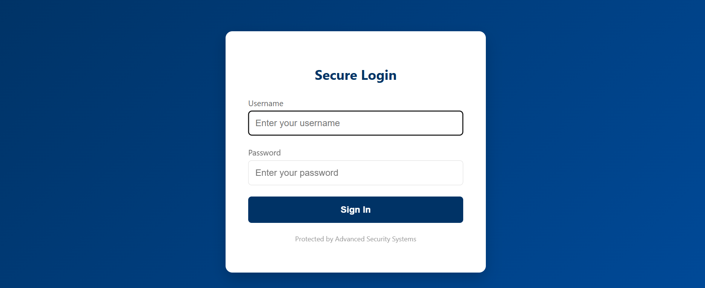

# Banking Supply Chain Attack Simulation
### About the Project
In recent months, we’ve seen more and more companies integrating AI chatbots into their websites to improve customer service. Often, these bots are provided by third-party vendors. While this is great for UX, it creates a massive security blind spot: if the vendor's code is compromised, the company's website is compromised too.

**I built this project to simulate that exact scenario. I wanted to see how a "trusted" third-party component—like a help-desk chatbot could be used as a vector for a supply chain attack.**

 ## Live Demo
You can check out the simulation here: [[Live Link Here](https://python-pickwiz.onrender.com)]

(Note: Use your own username/password to log in—it's just a simulation!)

## How it Works
I created a full-stack banking dashboard simulation to act as the "victim" site. The core of the project is the AI chatbot integration:

**The Vector:** I embedded a chatbot widget into the bank's dashboard.

**The Payload:** The bot is scripted to provide a "helpful" link to the user. In reality, this link contains a hidden JavaScript function.

**The Exfiltration:** When the user clicks the link, the script stealthily captures the user's session cookie and sends it directly to my logging server.

I paid attention to the small details to make this feel like a real-world scenario—from the professional banking UI to the actual cookie handling. I even set up a dedicated backend logger to verify that the "stolen" data is successfully received, which allowed me to document the entire attack flow.

## Screenshots

## Why this matters
This simulation shows why it’s not enough to secure your own code. You are only as secure as the weakest third-party library you run. By building this end-to-end, I was able to better understand the impact of XSS vulnerabilities in a real-world, high-stakes environment like a banking portal.

Disclaimer: This project was built for educational purposes only to demonstrate security vulnerabilities and how to defend against them.

### Tools Used: ###

Frontend: HTML5, JavaScript

Backend (C2 Server): Flask (Python)

Deployment: Render
